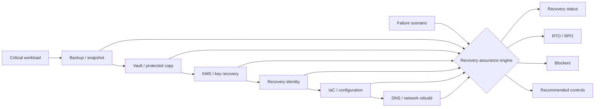

<div align="center">

# CloudRescue

### Cloud Ransomware Resilience & Recovery Assurance

**A defensive cloud-security lab that tests whether critical workloads can actually be restored after cloud control-plane compromise, backup tampering, key loss, region failure, recovery-identity compromise, or CI/CD state loss.**

[](https://github.com/VinayK88/CloudRescue/actions/workflows/ci.yml)
[](https://www.python.org/)
[](#what-cloudrescue-is-used-for)
[](#baseline-evidence)
[](#security--evaluation-boundary)

**Backup survivability · KMS resilience · isolated recovery identity · restore dependency graphs · RTO/RPO · cyber-recovery game days**

[Overview](#overview) · [Evidence](#baseline-evidence) · [Architecture](#architecture) · [Game Days](#recovery-game-days) · [API](#api--dashboard) · [Quick Start](#quick-start)

</div>

---


## Overview

CloudRescue starts from a problem that ordinary cloud posture tools do not answer well:

> **A backup existing is not the same as the business being recoverable.**

A restore may still fail because the attacker can modify backup retention, the encryption key lives in the same compromised trust boundary, the recovery identity is not isolated, infrastructure-as-code is unavailable, DNS cannot be reconstructed, or the only usable copy lives in the failed region.

CloudRescue models those dependencies explicitly and evaluates recovery under deterministic cloud-failure and ransomware scenarios.

```text
Production workload
      │
      ├── backup / immutable copy
      ├── KMS / key-recovery path
      ├── isolated recovery identity
      ├── infrastructure-as-code
      ├── DNS / routing rebuild
      └── cross-account / cross-region copy
                 │
                 ▼
          Recovery dependency graph
                 │
                 ▼
          Scenario / game-day fault
                 │
                 ▼
      READY / RECOVERABLE_WITH_GAPS
              / UNRECOVERABLE
                 │
                 ▼
       RTO · RPO · blockers · actions
```

The project intentionally separates **attack-path exposure** from **recovery assurance**. Its core question is not *“How did the attacker get in?”* but *“After the control plane is no longer trusted, can we restore the service safely?”*

---

## What CloudRescue is used for

| Use case | What it evaluates |
| --- | --- |
| **Cloud ransomware readiness** | Whether protected recovery paths survive loss of production administrative trust. |
| **Backup survivability** | Availability, immutability, and separation of backup copies. |
| **KMS / encryption recovery** | Whether encrypted backups remain decryptable after production-key loss. |
| **Recovery IAM isolation** | Whether the identity used for recovery is independent from the compromised production plane. |
| **Cross-account / cross-region resilience** | Whether a viable copy survives account- or region-level failure. |
| **IaC recovery** | Whether infrastructure can be reconstructed without relying on the compromised deployment state. |
| **RTO / RPO validation** | Whether synthetic restore time and data-loss objectives are met under each scenario. |
| **Cyber-recovery game days** | Reproducible exercises that expose hidden restore dependencies before a real incident. |

### Intended users

CloudRescue is designed for **cloud-security teams, security architects, incident-response teams, platform/SRE teams, disaster-recovery owners, ransomware-resilience programs, and security leadership** that need evidence about recoverability rather than only configuration findings.

---

## Baseline evidence

The checked-in deterministic baseline runs **6 recovery game-day scenarios** across synthetic AWS-, Azure-, and GCP-style workloads.

| Measure | Current baseline |
| --- | ---: |
| Recovery scenarios | **6** |
| Expected outcomes matched | **6 / 6** |
| Recovery-ready scenarios | **2 / 6** |
| Intentionally unrecoverable scenarios | **4 / 6** |
| RTO targets met | **2 / 6** |
| RPO targets met | **6 / 6** |
| Mean recovery confidence | **85.3 / 100** |
| Unit tests | **8 / 8 passing locally** |

The imperfect baseline is intentional. The project contains realistic control gaps so it can demonstrate **why recovery fails**, not just produce a green dashboard.

### Current game-day outcomes

| Scenario | Workload | Cloud | Outcome | Primary blocker |
| --- | --- | --- | --- | --- |
| Cloud administrator compromised | `payments-db-prod` | AWS | `READY` | none |
| Backup retention tampered | `customer-analytics` | Azure | `UNRECOVERABLE` | backup immutability |
| Production KMS path lost | `identity-store` | GCP | `UNRECOVERABLE` | independent key recovery |
| Primary region unavailable | `orders-api` | AWS | `READY` | none |
| Recovery identity compromised | `ml-registry` | Azure | `UNRECOVERABLE` | recovery identity isolation |
| CI/CD and IaC state lost | `billing-service` | GCP | `UNRECOVERABLE` | versioned recovery IaC |

The reproducible report is checked in at [`reports/baseline.json`](reports/baseline.json).

> These are deterministic synthetic results. They demonstrate recovery-decision logic and evidence accounting, not measured AWS/Azure/GCP recovery performance.

---

## Architecture



### Recovery dependency model

Each workload carries an explicit recovery profile:

```text
backup_available
backup_immutable
cross_account_copy
key_recoverable
recovery_identity_isolated
iac_available
dns_rebuildable
cross_region_copy
rto_target_minutes
rpo_target_minutes
estimated_restore_minutes
backup_age_minutes
```

CloudRescue then changes the **required control set** according to the game-day scenario.

For example, an ordinary restore may not require a cross-region copy. A region-loss game day does.

---

## Recovery decision model

CloudRescue returns three states:

| Status | Meaning |
| --- | --- |
| `READY` | All controls required by the current failure scenario survive. |
| `RECOVERABLE_WITH_GAPS` | Recovery remains possible, but non-blocking resilience gaps exist. |
| `UNRECOVERABLE` | At least one hard recovery dependency is unavailable. |

A hard blocker is more important than a generic cloud-risk score.

```text
Backup exists                 YES
Backup immutable              YES
Independent KMS recovery      NO
Recovery identity isolated    YES
IaC available                 YES

SCENARIO                       KMS LOSS
RESULT                         UNRECOVERABLE
ROOT CAUSE                     key_recoverable = false
```

---

## Recovery game days

### 1. Cloud administrator compromise

Production administrative trust is assumed compromised. Recovery now requires:

- a usable backup;
- immutable retention;
- a copy outside the production administrative boundary;
- independent key recovery;
- isolated recovery identity;
- reconstructable infrastructure and DNS.

The synthetic `payments-db-prod` profile passes this exercise.

### 2. Backup tampering

The game day assumes an attacker attempts to alter or expire recovery copies. A backup that is merely present but mutable does not count as surviving recovery evidence.

### 3. KMS / key-path loss

The encrypted backup may physically exist and still be useless. CloudRescue treats **decryptability** as a recovery dependency and fails the exercise when the independent key path is missing.

### 4. Region outage

The primary region is removed from the recovery plan. Cross-region copy availability becomes mandatory.

### 5. Recovery-identity compromise

If recovery uses the same identity plane as production, the recovery environment inherits the attacker’s trust. CloudRescue makes recovery-identity isolation an explicit control.

### 6. CI/CD and IaC-state loss

Recovery must reconstruct cloud resources without assuming the primary deployment pipeline or state store remains available.

---

## Example finding

```text
CLOUDRESCUE RECOVERY FINDING

Workload                 identity-store
Cloud                    GCP
Scenario                 kms-loss
Criticality              CRITICAL

Backup available         YES
Backup immutable         YES
Cross-account copy       YES
Independent key path     NO
Recovery identity        ISOLATED
IaC available            YES
DNS rebuildable          YES
Cross-region copy        YES

Recovery status          UNRECOVERABLE
Recovery confidence      78 / 100
Estimated RTO            65 min
Estimated RPO             8 min

Blocking dependency
- key_recoverable

Recommended action
- establish an independent, tested encryption-key recovery path
```

The confidence score is an **explainable project heuristic**, not a probability of successful disaster recovery.

---

## Input → output example

`POST /simulate`

### Input

```json
{
  "scenario_id": "kms-loss",
  "workload": "identity-store"
}
```

### Output

```json
{
  "scenario_id": "kms-loss",
  "workload": "identity-store",
  "cloud": "GCP",
  "status": "UNRECOVERABLE",
  "recovery_confidence": 78,
  "estimated_rto_minutes": 65,
  "estimated_rpo_minutes": 8,
  "rto_met": false,
  "rpo_met": true,
  "blockers": [
    "key_recoverable"
  ],
  "degraded_controls": [],
  "surviving_controls": [
    "backup_available",
    "backup_immutable",
    "cross_account_copy",
    "recovery_identity_isolated",
    "iac_available",
    "dns_rebuildable",
    "cross_region_copy"
  ],
  "recommended_actions": [
    "establish an independent, tested encryption-key recovery path"
  ]
}
```

This contract keeps **outcome, timing, hard blockers, surviving controls, and remediation** separate so a reviewer can immediately understand the failure.

---

## API & dashboard

CloudRescue includes a FastAPI service and lightweight dark recovery dashboard.

```bash
pip install -e '.[api]'
uvicorn cloudrescue.api:app --reload
```

Open:

```text
http://127.0.0.1:8000
```

Endpoints:

```text
GET  /healthz
GET  /report
GET  /scenarios
POST /simulate
GET  /docs
```

The dashboard summarizes recovery confidence, ready scenarios, failed restore paths, RTO performance, and each scenario’s blocking dependencies.

---

## Engineering & quality

| Area | Implementation |
| --- | --- |
| Recovery model | Typed Python dataclasses |
| Cloud coverage | Synthetic AWS / Azure / GCP-style profiles |
| Decision engine | Scenario-specific dependency evaluation |
| Recovery objectives | RTO / RPO evaluation |
| Explainability | Blockers, surviving controls, recommended actions |
| Interface | CLI + FastAPI dashboard/API |
| Reproducibility | Checked-in deterministic baseline |
| Deployment | Dockerfile |
| Quality | Unit tests + Python 3.10–3.12 CI |

---

## Quick start

```bash
git clone https://github.com/VinayK88/CloudRescue.git
cd CloudRescue

python -m venv .venv
source .venv/bin/activate
pip install -e '.[api]'

# Generate baseline recovery-assurance report
cloudrescue

# Run tests
python -m unittest discover -s tests -v

# Start dashboard/API
uvicorn cloudrescue.api:app --reload
```

Docker:

```bash
docker build -t cloudrescue .
docker run --rm -p 8000:8000 cloudrescue
```

---

## Repository map

```text
CloudRescue/
├── cloudrescue/
│   ├── models.py       # recovery profiles, scenarios, assessments
│   ├── fixtures.py     # synthetic multi-cloud recovery environment
│   ├── engine.py       # dependency + game-day evaluation
│   ├── report.py       # reproducible baseline report
│   ├── api.py          # FastAPI dashboard + simulation API
│   └── cli.py          # command-line report generator
├── assets/
│   └── cloudrescue-overview.svg
├── docs/
│   └── methodology.md
├── reports/
│   └── baseline.json
├── tests/
├── .github/workflows/
│   └── ci.yml
├── Dockerfile
├── SECURITY.md
└── README.md
```

---

## How this differs from the rest of the portfolio

```text
AttackPath AI
    → How can compromise propagate?

AI Data Center Security Digital Twin
    → What is the blast radius and systemic impact?

InfraGuard AI
    → Can a high-consequence AI-assisted system fail safely?

CloudRescue
    → After cloud compromise, can the business actually restore?
```

CloudRescue therefore focuses on a separate control plane: **recovery architecture**.

---

## Production evolution

A production implementation would replace synthetic profile fields with authorized provider evidence such as:

- backup-vault and snapshot configuration;
- retention / immutability status;
- cross-account and cross-region copy state;
- KMS/key-policy and recovery dependencies;
- workload and break-glass identities;
- infrastructure-as-code repositories and state backups;
- DNS/network reconstruction dependencies;
- application dependency maps;
- actual restore-test evidence;
- measured RTO/RPO from game days;
- recovery runbook and human-approval evidence;
- tamper-evident recovery audit logs.

A production system should never infer recoverability from configuration alone. **Successful, authorized restore testing is the evidence that matters.**

---

## Security & evaluation boundary

**Everything in this repository is synthetic and defensive.**

CloudRescue does not connect to real cloud accounts, modify backup policies, disable KMS keys, delete infrastructure, execute ransomware, or perform destructive disaster-recovery tests.

The project models the *defensive consequences* of assumed failures. It contains no cloud exploitation or destructive automation.

The recovery-confidence score, RTO, RPO, and scenario outcomes are deterministic lab values and must not be interpreted as production SLA guarantees, cloud-provider measurements, or certification.

See [`SECURITY.md`](SECURITY.md) and [`docs/methodology.md`](docs/methodology.md).

---

<div align="center">

### Backups are inventory. Recovery is evidence.

**Cloud Security · Ransomware Resilience · Recovery Engineering · RTO/RPO Assurance**

</div>
