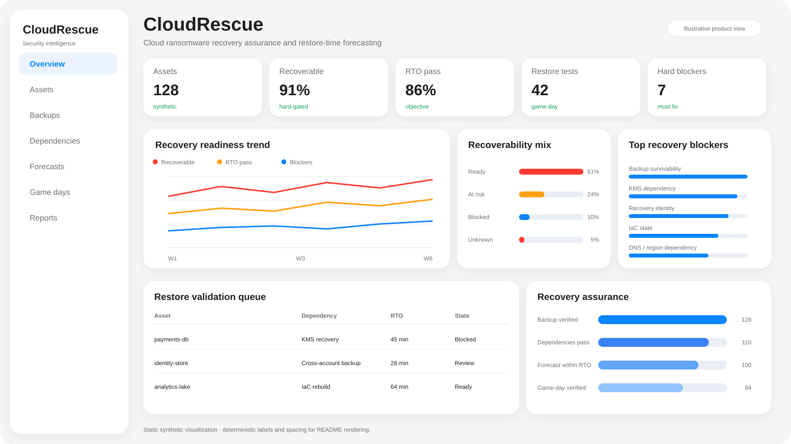
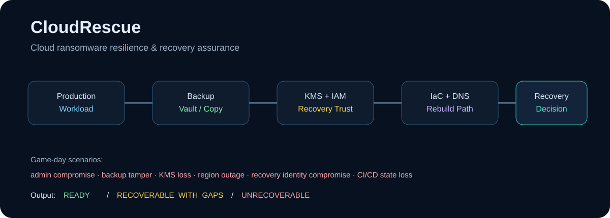
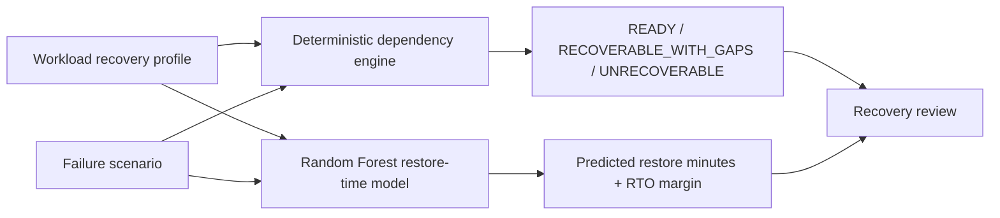

<div align="center">

# CloudRescue

### Cloud Ransomware Recovery Assurance · ML Restore-Time Forecasting

**A defensive cloud-security lab that combines hard recovery dependency checks with machine-learning forecasts for restore duration and RTO pressure.**

[](https://github.com/VinayK88/CloudRescue/actions/workflows/ci.yml)
[](https://www.python.org/)
[](#ml-restore-time-forecast)
[](#synthetic-baseline)

**Backup survivability · KMS · recovery IAM · IaC · RTO/RPO · Random Forest · cyber-recovery game days**

</div>

---





## Overview

CloudRescue separates two questions that should not be conflated:

> **Can this workload be recovered at all after the assumed cloud failure?**

> **If the required dependencies survive, how long might the restore take?**

The first question is answered by deterministic hard controls. The second now has an ML forecast.



**ML never overrides a hard recovery blocker.** A missing usable backup, independent key path, isolated recovery identity, IaC state, or other required dependency still produces `UNRECOVERABLE` regardless of the model forecast.

## Synthetic baseline

The deterministic baseline remains intentionally imperfect:

| Measure | Baseline |
| --- | ---: |
| Recovery scenarios | **6** |
| Expected statuses matched | **6 / 6** |
| Ready | **2 / 6** |
| Intentionally unrecoverable | **4 / 6** |
| Deterministic RTO targets met | **2 / 6** |
| RPO targets met | **6 / 6** |
| Mean recovery confidence | **85.3 / 100** |

Current synthetic exercises include cloud-admin compromise, backup tampering, KMS loss, region outage, recovery-identity compromise, and CI/CD/IaC loss across AWS-, Azure-, and GCP-style profiles.

## Deterministic recovery model

CloudRescue evaluates explicit dependencies:

```text
backup_available
backup_immutable
cross_account_copy
key_recoverable
recovery_identity_isolated
iac_available
dns_rebuildable
cross_region_copy
```

Scenario-specific requirements determine:

```text
READY
RECOVERABLE_WITH_GAPS
UNRECOVERABLE
```

This remains the authoritative recoverability decision because ML should not decide whether a missing cryptographic key, backup, or identity boundary somehow exists.

## ML restore-time forecast

CloudRescue now trains a seeded **RandomForestRegressor** on **1,200 deterministic synthetic recovery-history records**.

The feature set includes:

- baseline restore estimate;
- backup age;
- workload criticality;
- eight recovery-control states;
- cloud platform indicators;
- failure-scenario indicators.

The synthetic history generator produces exercise-duration targets with scenario overhead, control-gap penalties, workload/cloud effects, and bounded random variation. A fixed train/test split exposes reproducible held-out **MAE** and **R²** in the executable report.

For every baseline scenario CloudRescue returns:

- `predicted_restore_minutes`;
- `rto_target_minutes`;
- `predicted_rto_margin_minutes`;
- deterministic status and deterministic RTO alongside the forecast;
- `forecast_only=true` when the deterministic status is `UNRECOVERABLE`.

For an unrecoverable case, the forecast means **conditional timing if the blocker were remediated**. It is not evidence that recovery is currently possible.

Detailed methodology: [`docs/ml-recovery-model.md`](docs/ml-recovery-model.md).

## Why use ML here?

Recovery architecture contains hard binary dependencies, but actual restore duration is often influenced by many interacting factors. The portfolio architecture therefore becomes:

```text
Hard recovery controls      → recoverability
ML timing forecast          → restore-time / RTO pressure
RTO/RPO objectives          → business constraint
Human recovery exercise     → final operational evidence
```

That is a more defensible ML role than predicting a generic “ransomware risk score.”

## Example API result

`POST /simulate` now returns both layers:

```json
{
  "assessment": {
    "scenario_id": "kms-loss",
    "workload": "identity-store",
    "status": "UNRECOVERABLE",
    "blockers": ["key_recoverable"]
  },
  "ml_restore_forecast": {
    "scenario_id": "kms-loss",
    "workload": "identity-store",
    "deterministic_status": "UNRECOVERABLE",
    "predicted_restore_minutes": 0,
    "forecast_only": true
  }
}
```

The numeric prediction above is a schematic field example; executable forecasts are generated by the trained synthetic model at runtime.

## Dashboard & API

```bash
pip install -e '.[api]'
uvicorn cloudrescue.api:app --reload
```

Endpoints:

```text
GET  /healthz
GET  /report
GET  /scenarios
POST /simulate
GET  /docs
```

The dashboard now surfaces deterministic status, hard blockers, recovery confidence, and the ML restore-time forecast together.

## Quick start

```bash
git clone https://github.com/VinayK88/CloudRescue.git
cd CloudRescue
python -m venv .venv
source .venv/bin/activate
pip install -e '.[api]'
cloudrescue
python -m unittest discover -s tests -v
uvicorn cloudrescue.api:app --reload
```

Docker:

```bash
docker build -t cloudrescue .
docker run --rm -p 8000:8000 cloudrescue
```

## Portfolio distinction

```text
BrowserGuard → unsupervised browser-extension anomaly detection
AgentAtlas   → AI-agent posture anomaly + peer deviation
DeepTrace    → NLP narrative clustering with TF-IDF + DBSCAN
SaaSGraph    → OAuth/SaaS behavioral anomaly detection
CloudRescue  → supervised recovery-time regression under hard recovery constraints
```

## Evaluation boundary

Everything in this repository is synthetic and defensive. CloudRescue does not connect to real cloud accounts, change backup policies, disable KMS keys, delete infrastructure, or run destructive recovery exercises.

The held-out regression metrics only measure fit to the **synthetic recovery-history generator**. They do not establish forecasting accuracy for real AWS, Azure, or GCP recovery operations.

Production use should train on authorized historical game-day and restore data, add workload/storage-size features, estimate prediction intervals, monitor drift, and continuously validate forecasts against observed recovery exercises.

### Backups are inventory. Recovery is evidence.
